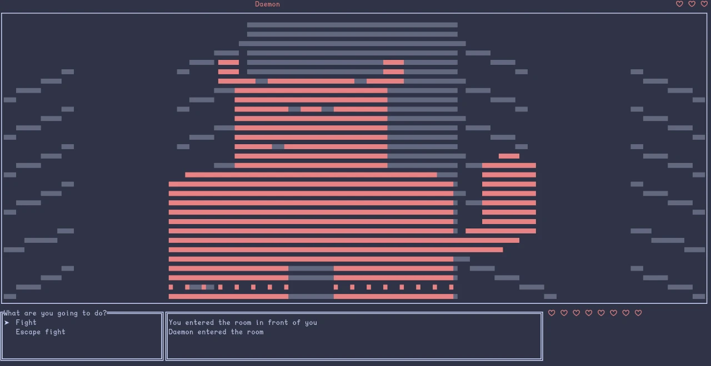
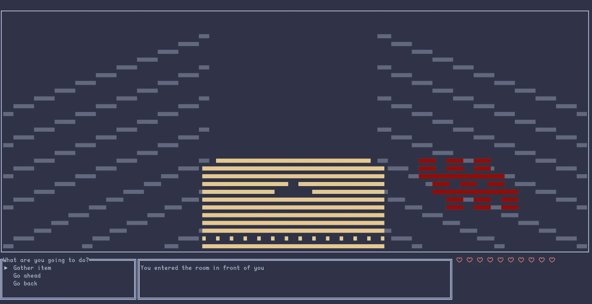
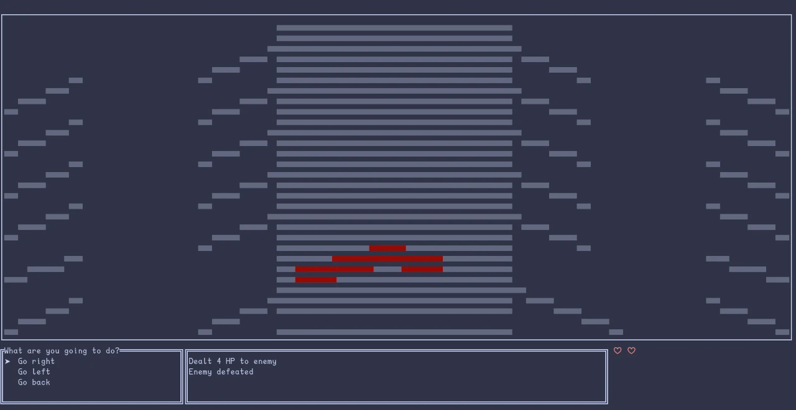

# donmaze

~ An interactive adventure terminal game in a labyrinth ~

  <a href="https://veeso.github.io/donmaze/" target="_blank">Website</a>
  ·
  <a href="https://veeso.github.io/donmaze/#get-started" target="_blank">Installation</a>

Developed by <a href="https://veeso.me/" target="_blank">@veeso</a>

Current version: WIP

  
  
  

---

## About donmaze

This was a project I started in 2022 and never finished.

It was basically an interesting experiment for making a terminal game with ratatui using a kind of isometric view.

The game actually runs and it's playable, even if I haven't managed to include every feature I wanted to.

The game is really hard to finish and it's quite boring tbh, but it was a fun project to work on.

**I highly suggest you to mute the volume** running it with `-m` flag, because the sound effects are done directly with frequencies and they are quite annoying and loud.

## Controls

| Key                              | Description                                         |
|----------------------------------|-----------------------------------------------------|
| Enter                            | Select                                              |
| Up, Down,                        | Move menu                                           |
| E                                | Open inventory                                      |
| Esc                              | Quit tuifeed                                        |

---

## Gallery 🎬

---

## License 📃

donmaze is licensed under the Apache License 2.0.

You can read the entire license [HERE](LICENSE)
